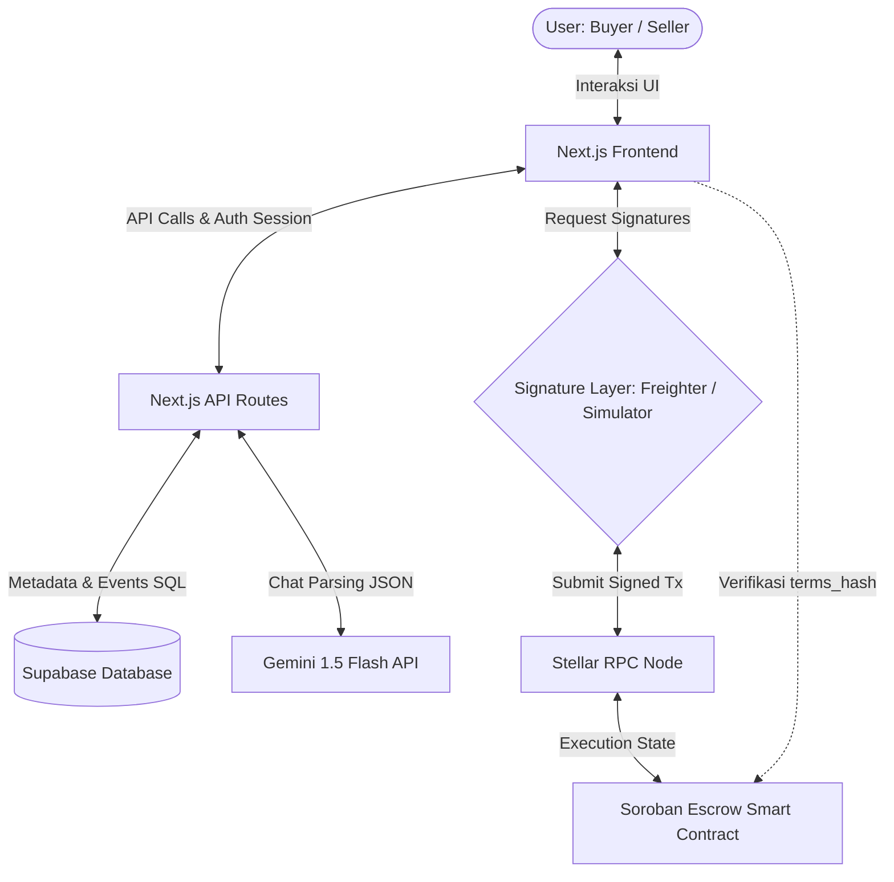
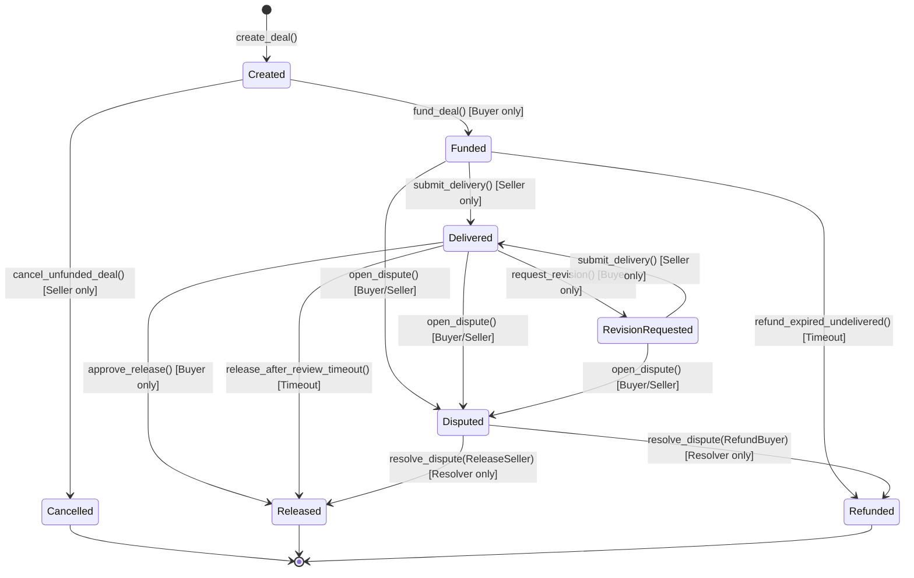

# AmanPay - System Architecture

Dokumen ini menjelaskan arsitektur sistem, desain smart contract, model penyimpanan data, sistem autentikasi, serta integrasi AI pada **AmanPay**.

---

## 1. Arsitektur Tingkat Tinggi (High-Level Architecture)

AmanPay memisahkan data menjadi dua lapisan: **lapisan on-chain (Stellar/Soroban)** untuk keamanan finansial dan keabsahan kesepakatan, serta **lapisan off-chain (Supabase)** untuk data deskriptif yang tidak efisien disimpan di blockchain (seperti deskripsi teks panjang, link lampiran privat, dan log event publik).



### Mekanisme Pengikatan Kriptografis (Cryptographic Binding)
Setiap deal yang dibuat di off-chain direpresentasikan sebagai metadata JSON kanonikal. Metadata ini di-hash menggunakan SHA-256 untuk menghasilkan `terms_hash`. 
- `terms_hash` disimpan secara permanen di blockchain pada saat `create_deal`.
- Halaman detail deal di frontend akan mengkueri metadata dari Supabase dan status dari blockchain, lalu merekonstruksi hash-nya secara lokal.
- Jika hash lokal cocok dengan `terms_hash` di blockchain, UI menampilkan status **"Terms Terverifikasi"** (aman).
- Jika ada manipulasi data di database, hash tidak akan cocok, dan UI menampilkan peringatan **"State Mismatch"** serta memblokir aksi funding.

---

## 2. Soroban Smart Contract Design

Kontrak pintar **AmanPayEscrow** bertindak sebagai engine rekber generik yang menampung dana, menegakkan aturan transisi status (state transitions), dan melakukan settlement (release/refund) secara otomatis.

### Mesin Status Escrow (State Machine)
Escrow bergerak secara deterministik melalui status berikut:



### Struktur Data (Rust)
```rust
pub struct Deal {
    pub id: u64,
    pub deal_type: DealType,
    pub seller: Address,
    pub buyer: Address,
    pub resolver: Address,
    pub asset: Address,
    pub amount: i128,
    pub terms_hash: BytesN<32>,
    pub delivery_hash: Option<BytesN<32>>,
    pub dispute_hash: Option<BytesN<32>>,
    pub delivery_deadline: u64,
    pub review_period: u64,
    pub review_deadline: Option<u64>,
    pub revision_limit: u32,
    pub revision_period: u64,
    pub revision_count: u32,
    pub status: DealStatus,
    pub created_at: u64,
    pub funded_at: Option<u64>,
    pub delivered_at: Option<u64>,
    pub closed_at: Option<u64>,
}
```

---

## 3. Off-Chain Database Schema (Supabase)

Supabase digunakan untuk mendukung fitur indexing dashboard, pelacakan timeline, pertukaran bukti pengiriman (private delivery proof), dan penghitungan reputasi profil terverifikasi.

### Skema Tabel Utama
1. **`deals`**: Menyimpan ringkasan metadata deal off-chain yang kanonikal.
2. **`deal_events`**: Menyimpan log aktivitas publik (fund, submit delivery, approve, dispute) yang diambil secara terverifikasi dari RPC blockchain.
3. **`deliveries`**: Menyimpan tautan dan catatan hasil kerja seller. Kolom data dienkripsi/dilindungi oleh backend.
4. **`deal_private_notes`**: Menyimpan catatan revisi dan alasan dispute secara privat.
5. **`auth_challenges`**: Mengelola siklus penandatanganan tantangan masuk (login challenge).

---

## 4. Keamanan & Model Autentikasi

Untuk melindungi kerahasiaan lampiran link pengiriman seller dan detail alasan dispute/revisi, AmanPay menerapkan **Cookie-based Wallet Authentication**:

1. **Request Challenge**: Wallet meminta challenge teks acak (XDR transaksi ber-nonce) dari `/api/auth/challenge`.
2. **Signature Verification**: Wallet menandatangani challenge. Backend memverifikasi tanda tangan kriptografis tersebut di `/api/auth/verify` dan mengeluarkan **HttpOnly Session Cookie** terenkripsi HMAC.
3. **Authorized API Access**: Saat meminta detail deal di `/api/deals/[id]`, backend memeriksa session cookie:
   - Jika wallet aktif di cookie cocok dengan `buyer` atau `seller` deal tersebut (atau `resolver` saat status dispute), backend mengembalikan payload dari tabel `deliveries` dan `deal_private_notes`.
   - Pengguna lain di luar deal hanya akan menerima metadata publik dan timeline publik, menjaga data delivery tetap aman 100%.

---

## 5. Arsitektur Hybrid AI Parser

Fitur pencerna chat kesepakatan menggunakan pendekatan **Hybrid**:

```text
User Text Input ──> Cek ENV GEMINI_API_KEY
                       │
                       ├── (Ada) ──> Panggil Gemini 1.5 Flash (REST) + responseSchema JSON
                       │               │
                       │               └── Gagal/Timeout ──> Fallback ke Regex Parser
                       │
                       └── (Tidak) ────────────────────────> Panggil Regex Parser Lokal (Instant)
```

- **Gemini Parser**: Menggunakan System Instructions terstruktur dan parameter `responseSchema` (structured outputs) untuk memastikan hasil ekstraksi berupa JSON valid dengan tipe properti yang konsisten.
- **Regex Fallback**: Modul parser regex lokal mengekstrak kata kunci, nominal angka (K, ribu, jt), deadline waktu relatif ("besok", "jumat", "X hari"), dan deliverable menggunakan ekspresi reguler yang telah diuji secara ketat via Vitest.

---

## 6. Arsitektur Wallet Simulator

Untuk kelancaran demonstrasi tanpa Freighter extension, AmanPay mengimplementasikan **Wallet Simulator Klien**:

1. **Keypair Generation**: Klien menghasilkan kunci Stellar privat/publik acak menggunakan `@stellar/stellar-sdk` dan menyimpannya di `localStorage` per peran (`seller` dan `buyer`).
2. **Auto-Funding**: Klien mendeteksi jika saldo wallet simulator kosong di blockchain testnet, lalu secara asinkron memicu **Stellar Friendbot** (`https://friendbot.stellar.org`) untuk menyuntikkan 10,000 XLM secara gratis.
3. **Local Transaction Signing**: Saat melakukan submit transaksi Soroban, transaksi XDR dikirim ke frontend, didekode, ditandatangani menggunakan `keypair.sign()`, dan didorong kembali ke Stellar RPC, menyajikan eksekusi on-chain nyata secara transparan.
